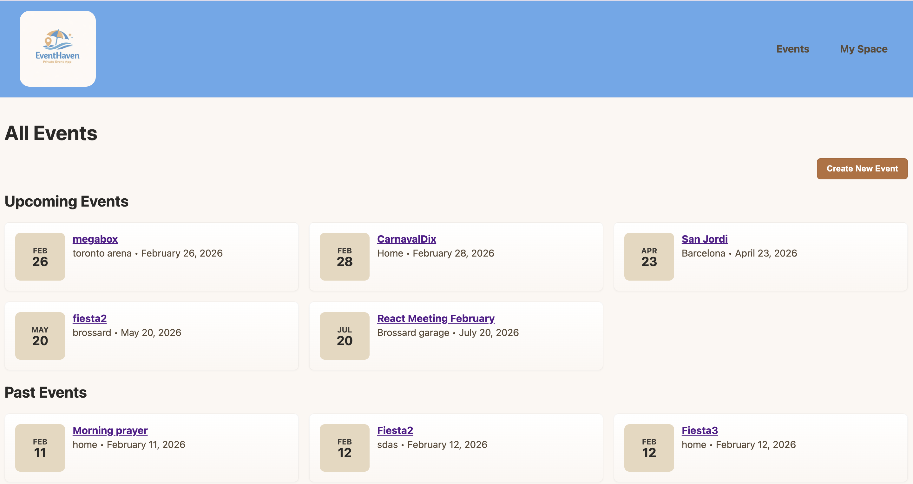
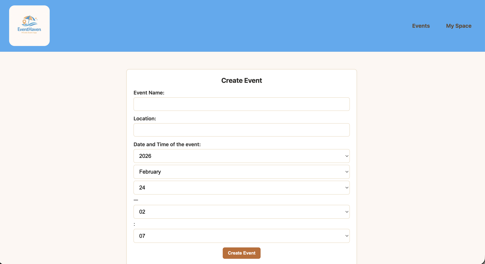
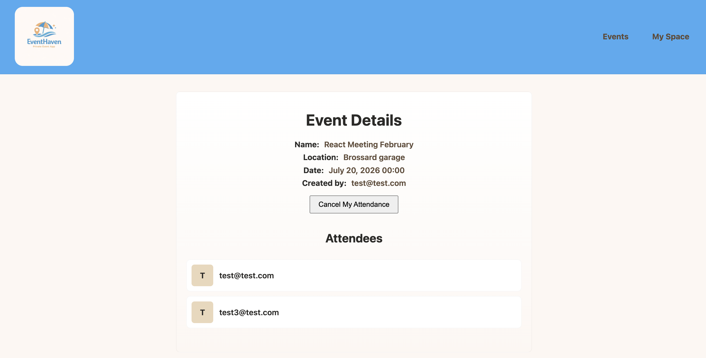
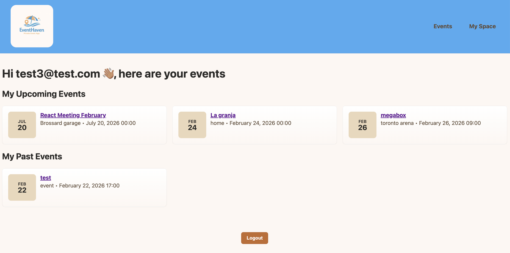
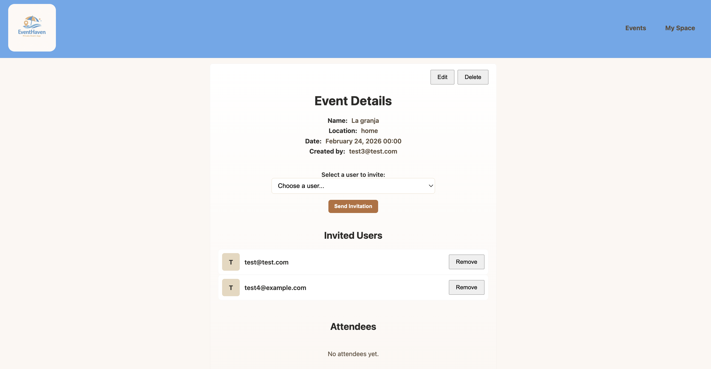

# Private Events

## Description

Private Events is a Rails application built as part of The Odin Project curriculum. The app allows users to create and attend private events much like Eventbrite.

## 🌟 Demo


## Getting Started

- Clone the repository

```bash
git clone https://github.com/keshiacor/private-events.git
```

- Navigate into the project directory

```bash
cd private-events
```

- Install Ruby gems

```bash
bundle install
```

- Set up the database (create, migrate, and seed if needed)

```bash
bin/rails db:prepare
```

- Start the Rails server

```bash
bin/rails server
```

- Open the app in your browser

Visit `http://localhost:3000` and sign up for an account to start creating events.

## Technologies

- Ruby on Rails 8.1 – Web framework used to build the application.
- SQLite3 – Default development and test database.
  TDB

## Features

- Users can sign up, log in, and log out using Devise for authentication.
- Users can create events with a name, description, date, and location.
- Users can see the list of all upcoming and past events in EventHaven.
- Users can only access events they have created or events they've been invited to.
- Users are automatically marked as attending the events they create.
- A user can invite other users to the events they have created.
- A user can rescind an invitation they have sent to another user.
- A user can edit, update or delete an event they have created.
- An event can have multiple attendees.

## Usage

Events Page


Event creation form


Event details page - invitee's view


User's my space showing upcoming and past events


Event details page - creator's view


## Important Dependencies

- Devise – Used for user authentication and management.
- RSpec – Used for testing the application.
- Stymulus – Used for styling the application.
